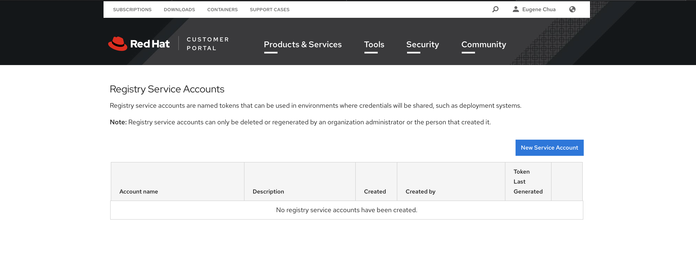
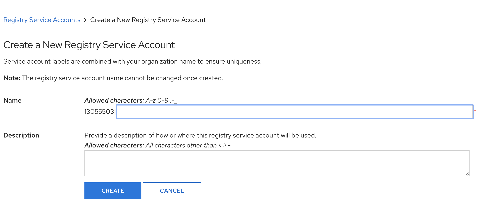
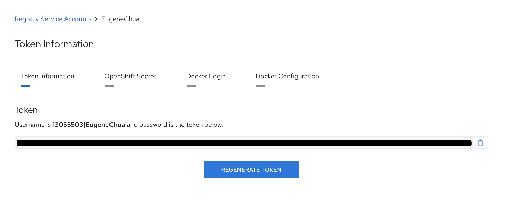
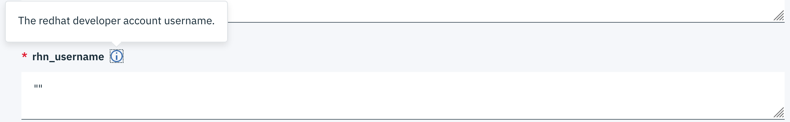
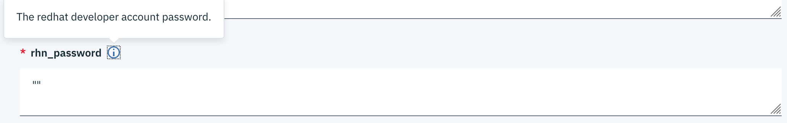
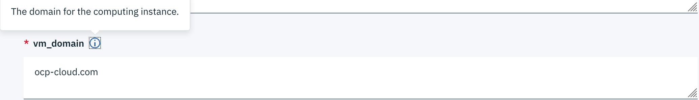

# redhat-developer-registry-service-account

This repo guide you how to get developer account subscription with redhat registry service account

### Prerequisite

- Have an existing RedHat account. Else, you can create it [redhat developer subscription](https://developers.redhat.com/register/).

### The reason you want to use registry service account

- Your password have special characters, i.e. (!,\$,&) and lead to `subscription-manager` return a similar error message

```
Description of problem:
subscription-manager fails to register when given a password containing special characters
```

- According to [Registry Service Accounts for Shared Environments](https://access.redhat.com/RegistryAuthentication)

```
To consume container images from registry.redhat.io in shared environments such as OpenShift, it is recommended for an administrator to use a Registry Service Account, also referred to as authentication tokens, in place of an individual's Customer Portal credentials.

Service Accounts are a mechanism provided to a Customer Portal organization, used exclusively for authenticating to and retrieving content from registry.redhat.io. The use of Service Accounts is encouraged to prevent the need to use Customer Portal credentials on shared systems, in contrast to Customer Portal accounts, Registry Service Accounts are resilient to some security controls applied to Customer Portal accounts, such as mandated password resets.
```

---

### Step for Creating a RedHat Registry Account

Step 1:
Go to this [link](https://access.redhat.com/terms-based-registry/?extIdCarryOver=true&intcmp=701f20000012k6YAAQ&sc_cid=701f2000001OH7YAAW). Sign in when prompted.
You should see the page below:



Select on "New Service Account".

Step 2:
Fill in the name and add any description you want.


Select "CREATE" when you are done.

Step 3:
You'll see you username and you token will be generated.


---

### Use the account username and password in Cloud Automation Manager terraform temaplate.

- Fill in your username
  

- Fill in your password
  

- You may change the value for `vm_domain` to the domain belong to you. You may obtain one from godaddy or cloudfare.
  
